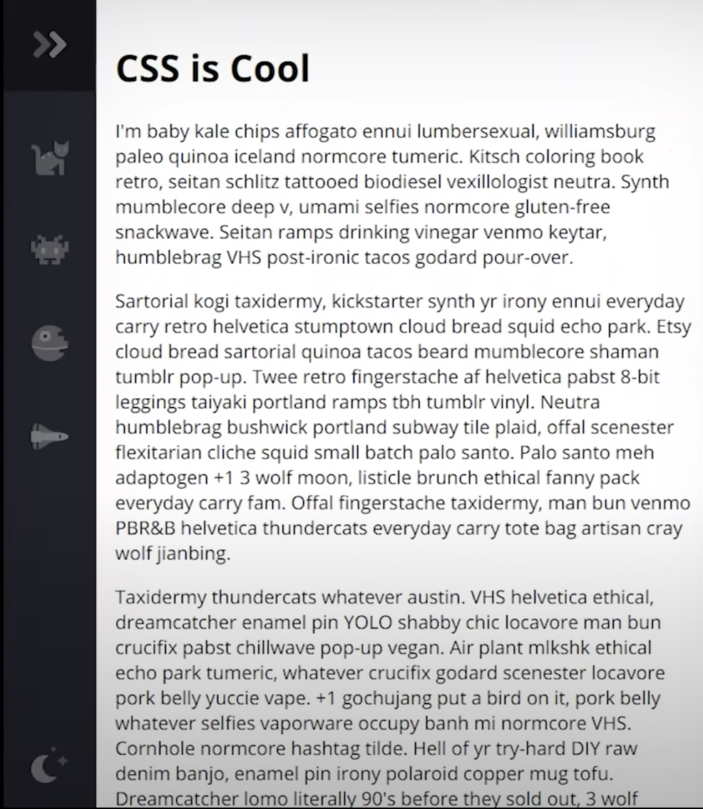
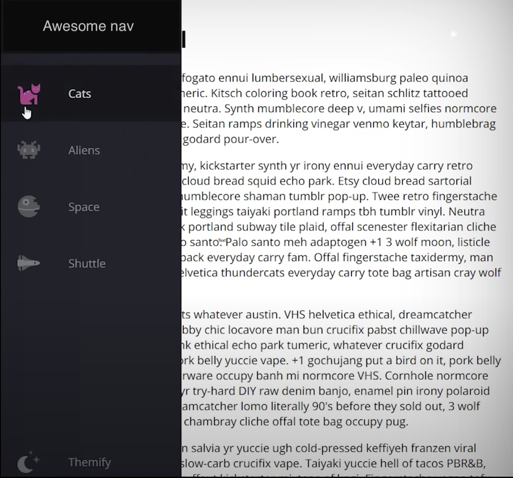

## Challenge

Add styles to the existing template in order to achieve the following result:

### Hints 
- Navbar should be closed by default.
- When hovering over the navbar it should open up above the content and show the menu item names.

